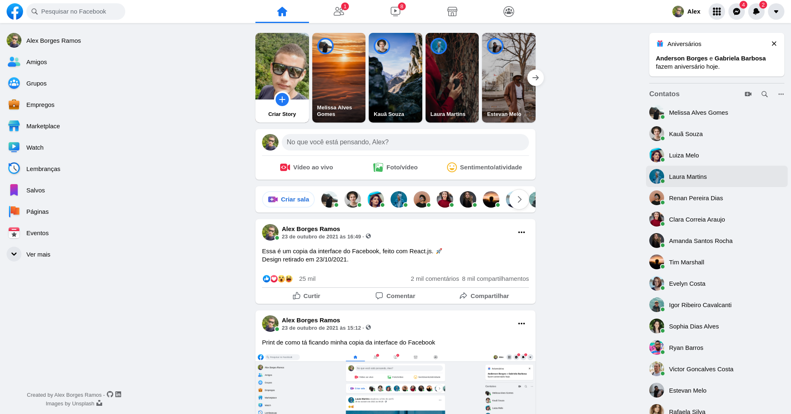

# Facebook - UI Clone

<p align="center">
  
  
  
  <a href='https://coveralls.io/github/AlexBorgesDev/facebook-ui-clone?branch=main'></a>
</p>



> Access the project through this link: [https://facebook-ui-clone-kohl.vercel.app](https://facebook-ui-clone-kohl.vercel.app)

This project is a copy of the facebook Home page interface. Built with React and Typescript, using styled-components lib to generate style sheets.

## 🚀 Installation

With a terminal open at the root of the project, execute one of the commands below:

```bash
npm install
```

or with yarn

```bash
yarn
```

### Running the app

To run the application run the command:

```bash
npm run start
```

or with yarn

```bash
yarn start
```

### Running the tests

To run the tests run the command:

```bash
npm run test
```

or with yarn

```bash
yarn test
```

## 📝 License

This project is under the MIT license. See the [LICENSE](LICENSE) file for more details.
